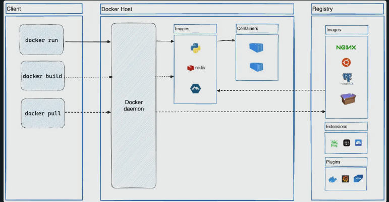

# Docker

## Conceptos básicos

Docker permite separar nuestra aplicacion de la infraestructura

## ¿Qué es Docker?

Docker es una plataforma para el desarrollo, entrega y ejecución de aplicaciones, tomando las ventajas de las metodologias de entrega, pruebas y despliegue de codigo de Docker usted puede significativamente reducir los tiempos de escrituta de codigo y la ejecución en producción

### Plataforma Docker

Docker tiene la capacidad de empaquetar y correr una aplicación en un entorno aislado llamado **Contenedor**. Este aislamiento y seguridad te permiten correr varios contenedores simultaneamente.

Los contenedores son ligeros y tienen todo lo necesario para correr la aplicación asi que no necesitas verificar todo lo que esta instalado en el host

Docker facilita herramientas y una plataforma para gestionar el ciclo de vida de los contenedores:

- Desarrollar la aplicación y sus componente de soporte utilizado contenedores
- El contenedor se convierte en la unidad para distribuir y probar tu aplicación
- Cuando este listo, desplegar la aplicación en un entorno de producción como un contenedor o un servicio de orquestación

## Arquitectura de Docker

Docker utiliza una arquitectura cliente servidor. El cliente docker habla a un demonio Docker el cual hace el trabajo pesado de construir, ejecutar y distribuir tus contenedores Docker. El cliente Docker y el demonio pueden correr en el mismo sistema, o tu puede conectar un cliente Docker a un demonio Docker remoto. El cliente Docker y el domonio se comunica utilizando API REST, sobre sockets de Unix o una interface de red. Otro cliente Docker es Docker Compose que te permite trabajar con aplicaciones que consisten en un conjunto de contenedores.

https://docs.docker.com/get-started/docker-overview/

### Demonio de Docker

El demonio de Docker *(dockerd)* escucha  las solicitudes de API docker y gestiona objetos Docker como imagenes, contenedores, redes y volumenes. Un demonio tambien se puede conectar con otros demonios para gestionar servicios Docker.

### Cliente Docker

El cliente Docker es la primer forma de que muchos usuarios interactuan con Docker. Por ejemplo cuando usas el comando:

~~~
docker run
~~~

El cliente envia este comando a Docker, el cual las lleva a cabo

### Docker Desktop

Docker desktop es facil de instalar en Mac, Windows lo que te permite crear y compartir aplicaciones en contenedores y microservicios. Docker Desktop incluye:
- Demonio de Docker *(dockerd)* 
- Cliente Docker *(docker)*
- Docker Compose
- Docker Content Trust
- Kubernetes
- Credential Helper

### Docker Registries

Un registro de Docker almacena imagenes de Docker. Docker Hub es un registro público que cualquiera puede usar y **Docker** busca por imagenes en **Docker Hub** por defecto. Incluso puedes ejecutar tu propio registro privado
 
Cuando usas uno de los siguientes comandos:

~~~
docker pull
docker run
~~~

Docker trae todas las imagenes solicitadas desde tu configuración de registro. 

Cuando usas el comando:

~~~  
docker push
~~~

Dockeer empuja tu imagen a tu configuración de registro

### Objetos Docker

Cuando usas Docker, tu estas creando y usando imagenes, contenedores, redes, volumenes, plugins y otros objetos:

#### Imagenes

Una imagene es una plantilla de solo lectura con instrucciones para crear un contenedor Docker. A menudo una imagen se basa en otra imagen, con algunas personalizaciones adicionales. Por ejemplo cuando tu creas una imagen basada en Ubuntu , pero instalas el servidor Apache y tu aplicación, asi como los detalles de configuración necesarios para hacer que tu aplicación se ejecute.

Tu podrias crear tu propia imagen o podrias usar solo aquellas creadas y publicadas por otros en el registro. Para construir tu propia imagen, tu creas un **Dockerfile** con una sintaxis simple para definir los pasos necesarios. Cada instrucción crea una capa *(Layer)* en la imagen. Cuando cambias una Dockerfile y reconstruyes la imagen, solo las capas que fueron cambiadas son reconstruidas. Esto es parte de lo que las imagenes hace que sean livianas, pequeñas y rapidas comparadas con otras tecnologías de virtualización.

#### Contenedores

Un contenedor es una instancia ejecutable de una imagen. Puedes crear, comenzar, parar, mover o eliminar un contenedor usando Docker API o CLI. Puede conectar un contenedod a una o mas redes, añadir almacenamiento o incluso crear una nueva imagen basado en el estado actual.

Un contenedor esta definido por su imagen asi como las opciones de configuración que tu le asignas. Cuando un contenedor es eliminado cualquier cambio en su estado que no este guardado en un almacenamiento persistente desaparece.

El siguiente comando corre un contenedor Ubuntu añadido interactivamente a su sesion de comandos en linea local y ejecuta /bin/bash

~~~
docker run -i -t ubuntu /bin/bash
~~~

Cuando ejecutas este comando, pasa lo siguiente:

1. Si no tienes la imagen de Ubuntu local. Docker la extrae del registro configurado como si hubiera ejecutado **docker pull ubuntu** manualmente.
2. Docker crea un nuevo contenedor, como si se hubiera ejecutado el comando **docker container create** manualmente.
3. Docker asigna un archivo de sistema de lectura y escritura al contenedor, como capa final. Esto permite que un contenedor en ejecución cree o modifique archivos y directorios en su sistema de archivos local.
4. Docker crea una interface de red para conectar la el contenedor a un red por defecto, si no especificas ninguna opcion de red. Esto incluye asignar una dirección IP al contenedor. Por defecto los contenedores pueden conectarse a redes externas usando la conexión de red de la maquina anfitriona.
5. Docker inicia el contenedory el ejecuta */bin/bash*. Por que el contenedor esta ejecutandose interactivamente y adjunto a su termina (due to the -i and -t flags), puedes suministrarle entradas usando tu teclado mientras Docker registra la salida en tu terminal.
6. Cuando ejecutar el comando **exit** para terminar el comando /bin/bash, el contenedor para pero no es eliminado. Puedes iniciarlo de nuevo o eliminarlo.

### Tecnología subyacente

Docker esta escrito en el lenguaje de programación Go y toma las ventajas de varias de las caracteristicas del kernel de Linux para entrega esta funcionalidad. Docker usa una tecnología llamada **namespaces** para suministrar un workspace aislado llamado contenedor. Cuando tu ejectuas un contenedor. Docker crea un conjunto de namespaces para el contenedor.

Estos namespaces suministrar una capa de aislamiento. Cada aspecto de un contenedor corre en namespaces separados y su acceso es limitaado al namespace

https://docs.docker.com/get-started/introduction/

