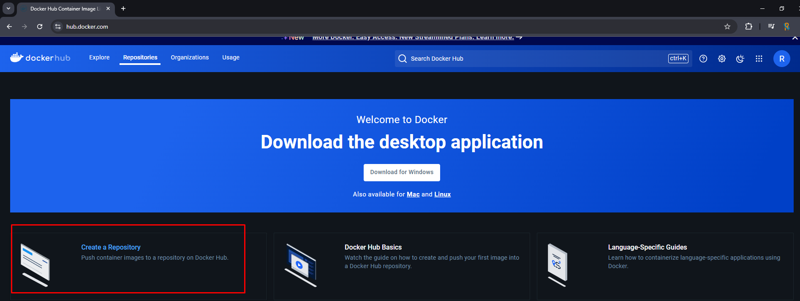
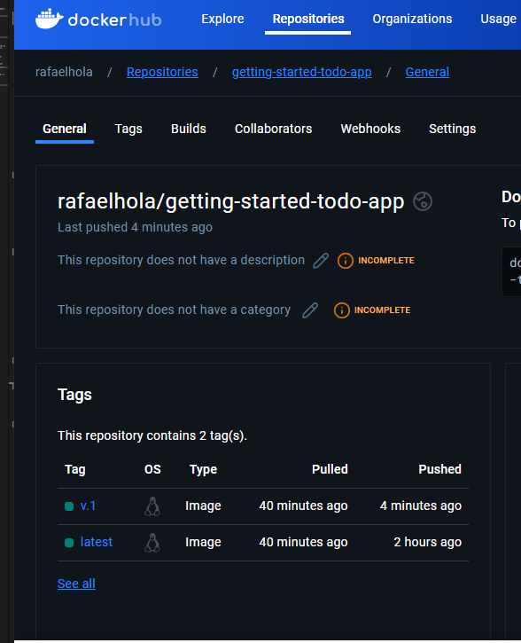
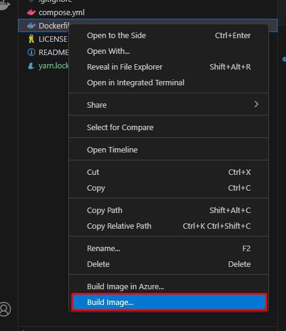
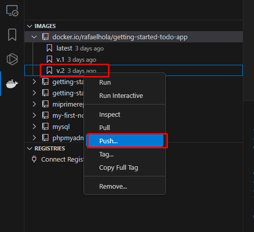

## Desarrollo con Contenedores

Aprender como correr el primer contenedor, adquiriendo experiencia con las potentes funciones de Docker. Cubriremos la realización de cambios en tiempo real tanto en el código de backend como en el de frontend dentro del entorno contenedorizado. 

Paso 1: Clonar el repositorio:

~~~git
git clone https://github.com/docker/getting-started-todo-app
cd getting-started-todo-app
docker compose watch
~~~

Veras una salida 

## Construir y hacer push de tu primera imagen

Aprende como crear tu primera imagen de Docker, un paso clave en la conteneriazación de tu aplicación. Crearemos una repositorio imagen y haremos la construcción y push de la imagen en **Docker Hub**. Esto te permite compartir tu imagen facilmente con tu equipo de trabajo

Primeramente tenemos que crear un cuenta en Docker, e ingresamos a la web:

https://hub.docker.com/

Y asi creamos el repositorio, desde la interfaz web

Creamos el proyecto corriendo el siguiente comando, cambiando <DOCKER_USERNAME> por el nombre de usuario

~~~
docker build -t <DOCKER_USERNAME>/getting-started-todo-app .
~~~

Para verificar la lista de imagenes locales, use el sgte comando:

~~~
docker image ls
~~~

Para empujar la imagen, use el comando docker push

~~~
docker push DOCKER_USERNAME/getting-started-todo-app
~~~

## Tag en Docker

Un tag en Docker asigna un unico identificador para para una imagen Docker. Hay un conjunto de imagenes similiares pero con diferentes versiones identificadas por tags en un repositorio Docker. Acá aprenderemos a etiquetar una imagen usando **docker build** y **docker tag**

### Entendiendo como funcionan los Docker Tag's

Un tag en Docker ayuda a mantener la version de compilación para enviar la imagen a Docker Hub. Docker Hub nos permite agrupar imagenes juntas basadas en el nombre y la etiqueta. Multiples tags pueden apuntar a una imagen en particular.

Para crear un tag de una imagen en particular, se utiliza el comando **docker tag** el cual toma como primer parametro la version de la etiqueta en base a la cual se creara la otra versio *rafaelhola/getting-started-todo-app:latest* y como segundo parámetro el nombre de la imagen mas la etiqueta de esta nueva versión

~~~
docker tag rafaelhola/getting-started-todo-app:latest rafaelhola/getting-started-todo-app:v.1
~~~

Y se utiliza el sgte comando para subir a Docker Hub

~~~
docker push rafaelhola/getting-started-todo-app:v.1
~~~

### Hacer lo mismo, pero desde VS Code

Para hacer lo mismo desde VS Code, tenemos que tener instalado la extensión de Docker.

- **Paso 1:** Construir desde el dockerfile del proyecto, asignar el nombre de nombre de la imagen mas la etiqueta de esta nueva

- **Paso 2:** Una vez que ya se tiene el Tag dentro de la imagen, se le hace el push para enviarlo a Docker Hub

