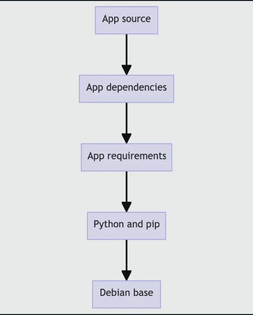
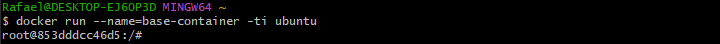
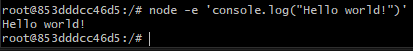

## Entendiendo las capas de imagen

Las imágenes del contenedor se componen de capas. Y cada una de estas capas una vez creadas son inmutables. Pero que significa esto? y como esas capas usadas para crear archivos de sistema que un contenedor puede usar?

### Capas de Imagen

Cada capa de una imagen contiene un conjunto de cambios en el sistema de archivos: adiciones, eliminaciones o modificaciones. Veamos una imagen teórica:

1. La primera capa adiciona comandos basicos y un gestor de paquetes, tal como _apt_
2. La segunda capa instala un entorno de ejecución de Python y Pip para la gestión de dependencias
3. La tercera capa copia el archivo requirements.txt específico de una aplicación.
4. La cuarta capa intala dependencias especificas de la aplicación
5. La quinta capa copia en codigo fuente actual de la aplicación



Esto es benficioso por que permite a las capas ser reusadas entre imagenes. Por ejemplo imagina que quieres crear otro aplicación Python. Debido a la estratificación, puyedes aprovechar la misma base de Python. Esto hara contrucciones mas rapido y reducira el almacenamiento y ancho de banda requerido para distribuir las imagenes.

### Apilando las capas

La superposición es posible gracias al almacenamiento direccionable por contenido y a la unión de sistemas de archivos, asi es como funciona:

1. Después de descargar cada capa, se extrae en su propio directorio en el sistema de archivos del host.
2. Cuando ejecutas un contenedor desde una imagen, una union de archivos de sistema es creada donde las capas son apiladas una sobre otra, creando una nueva vista y unificada
3. Cuando un contenedor inicia, su directorio raíz se establece en la ubicación de este directorio unificado, utilizando chroot

Cuando la union de archivos de sistema es creado, adicionalmente a las capas de imagen un directorio es creado especialmente para el contenedor en ejecución. Esto permite que el contenedor realice cambios en el sistema de archivos mientras permite que las capas de la imagen original permanezcan intactas. Esto le permite ejecutar múltiples contenedores desde la misma imagen subyacente.

### Probando

Creara una nueva imagen usando el comando

```
 docker container commit
```

Ten en cuenta que tu raramente crearas imagenes de esta forma, por lo general tu usuaras un **Dockerfile**.

### Crear una imagen base

En la terminal ejecutar el comando:

```
docker run --name=base-container -ti ubuntu
```

Una vez ejecutado deberias poder ver la terminal como esta, la cual esta corriendo dentro del contenedor:



Dentro del contenedor ejecutar el siguiente comando para instalar Node:

```
apt update && apt install -y nodejs
```

Cuando el comando se ejecuta, descarga e instala Nodejs dentro el contenedor

Para validar que node este instalado correctamente ejecutar el siguiente comando:

```
node -e 'console.log("Hello world!")'
```

donde deberia aparecer algo como esto:



Ahora que tienes Node instalado, ya esta listo para guardar los cambios que has estado haciendo como una nueva capa de imagen, desde la cual puedes iniciar nuevos contenedores o construir nuevas imagenes. Para realizarlos deberas utilizar **docker container commit**

Ejecuta el siguiente comando

```
docker container commit -m "Add node" base-container node-base
```

**Descripcion del comando**

1. **docker container commit:** Este comando crea una imagen nueva a partir de un contenedor existente. Es útil si realizas cambios en un contenedor (por ejemplo, instalas software adicional) y deseas guardar esos cambios en una nueva imagen.
2. **-m "Add node":** La opción -m permite añadir un mensaje descriptivo sobre lo que se ha cambiado en la nueva imagen. En este caso, el mensaje es "Add node", indicando que se ha agregado Node.js o algo relacionado a esta nueva imagen.
3. **base-container:** Este es el nombre o el ID del contenedor a partir del cual se desea crear la nueva imagen. En este caso, se está usando el contenedor base-container como base.
4. **node-base:** Este es el nombre que se le dará a la nueva imagen creada a partir del contenedor base-container. En este caso, la nueva imagen se llamará node-base.

Visualiza las capas de tu imagen usando el comando:

```
docker image history node-base
```

Para probar que node ha sido instalado, puede iniciar un nuev contenedor usando esta nueva imagen

```
docker run node-base node -e "console.log('Hello again')"
```

**Descripcion del comando**

1. **docker run:** Este es el comando para crear y ejecutar un contenedor a partir de una imagen Docker. Se asegura de que el contenedor se inicie, ejecute el comando especificado y luego se detenga.
2. **node-base: **Es el nombre de la imagen Docker que se usará para crear y ejecutar el contenedor. En este caso, se está utilizando la imagen node-base, que probablemente tenga Node.js instalado, ya que se está ejecutando un comando relacionado con Node.js.
3. **node:** Este es el comando que se ejecutará dentro del contenedor. En este caso, estás invocando el intérprete de Node.js (node). El contenedor ejecutará Node.js para procesar el código que sigue.
4. **-e "console.log('Hello again')":** La opción -e en este caso es un argumento para Node.js, que ejecuta el código JavaScript que se pasa entre comillas. En este caso, estás ejecutando un fragmento de código JavaScript con console.log('Hello again'), que imprimirá "Hello again" en la consola.

Una vez que haz creado la base de tu imagen, puedes eliminar el contenedor:

```
docker rm -f base-container
```

**Descripcion del comando**

1. **docker rm:** Este comando se utiliza para eliminar un contenedor Docker. Si el contenedor está detenido o no lo necesitas más, docker rm lo elimina completamente del sistema.
2. **-f (force):** La opción -f (abreviatura de "force") fuerza la eliminación del contenedor, incluso si está en ejecución. Normalmente, si un contenedor está en ejecución, tendrías que detenerlo primero con docker stop o docker kill. Sin embargo, al usar -f, Docker detiene y elimina el contenedor en un solo paso.
3. **base-container:** Este es el nombre o el ID del contenedor que quieres eliminar. En este caso, el contenedor que se está eliminando se llama base-container.

### Crear una imagen de aplicación

1. Iniciemos un nuevo contenedor usando la imagen base del nodo recien creado

```
docker run --name=app-container -ti node-base
```

**Descripcion del comando**

1. **docker run:** Este comando se utiliza para crear y ejecutar un nuevo contenedor a partir de una imagen Docker. Si la imagen no está disponible localmente, Docker la descargará.
2. **--name=app-container:** Con la opción --name, puedes asignar un nombre personalizado al contenedor que se va a crear. En este caso, el contenedor se llamará app-container. Esto es útil para identificar y manejar contenedores fácilmente sin tener que recordar el ID generado por Docker.
3. **-ti:** Es una combinación de dos opciones:
   - **-t:** Asigna una pseudo-TTY (teletipo), lo que significa que te proporciona una interfaz de terminal interactiva. Básicamente, habilita un entorno de terminal para interactuar con el contenedor.
   - **-i:** Mantiene la entrada estándar (stdin) abierta para que puedas interactuar con el contenedor. Esto es necesario para que puedas escribir comandos manualmente o interactuar con el contenedor mientras está en ejecución.
   - La combinación -ti permite que el contenedor se ejecute de forma interactiva, como si estuvieras accediendo a una terminal dentro del contenedor.
4. **node-base:** Es el nombre de la imagen Docker que se utilizará para crear y ejecutar el contenedor. En este caso, se está utilizando la imagen node-base, que probablemente contiene Node.js u otros recursos configurados.

https://docs.docker.com/get-started/docker-concepts/building-images/understanding-image-layers/
